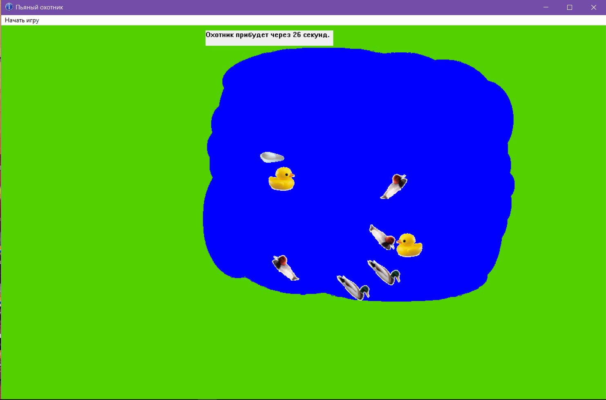
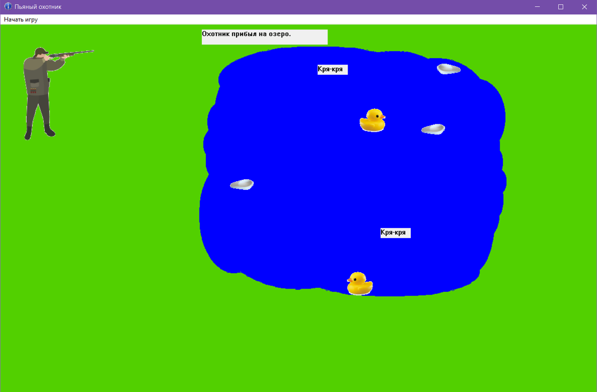

# Drunken Hunter
The Drunken Hunter is a game written in C++ 17 in Visual Studio 2017 for practice OOP skills.
it is an application that takes "duck typing" ("https://en.wikipedia.org/wiki/Duck_typing") as a basis, implementing additional functionality.

## License
Copyright (c) Mileta Kirill. All rights reserved.

Licensed under the [MIT License](LICENSE).
